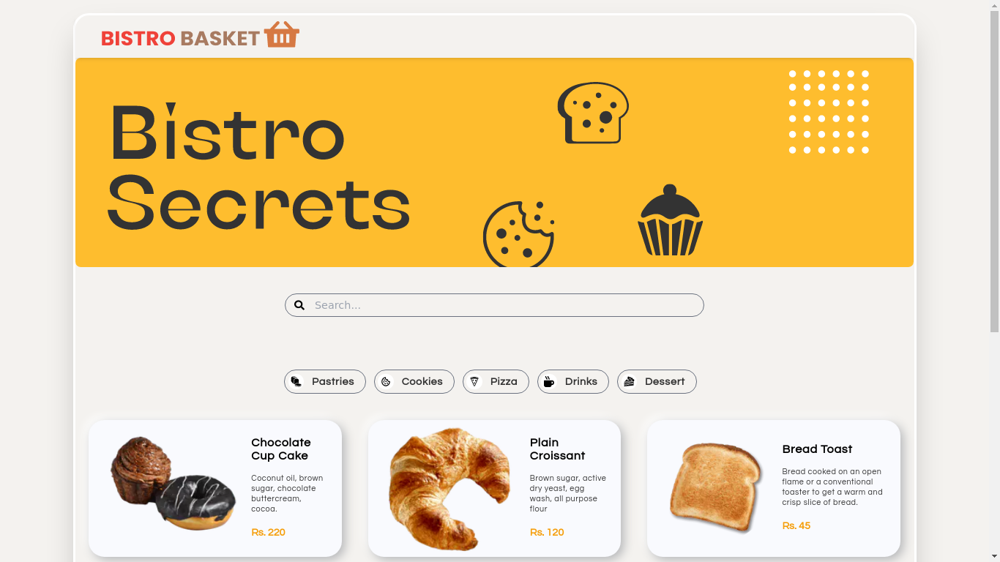
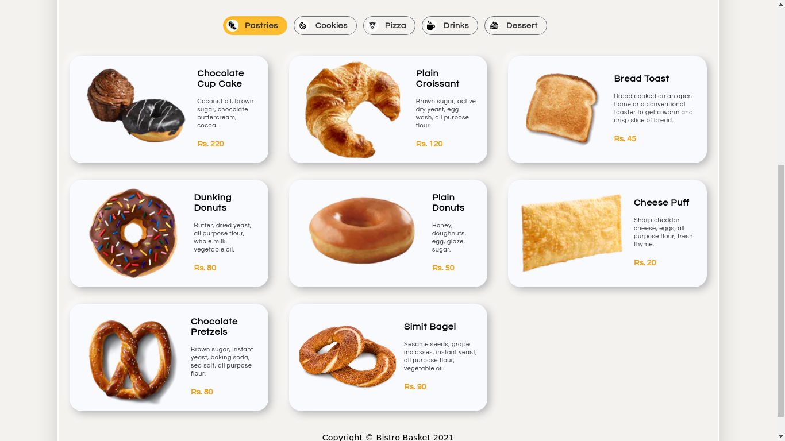
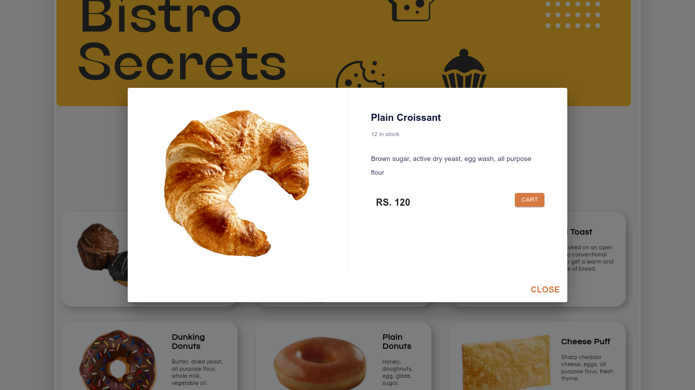

# Bistro Baset 🧺

Bakery shop application built using Nextjs framework with
tailwind css as css util library and Strapi backend which is
a headless cms

## Deployed on vercel

https://bistrobasket.vercel.app/
